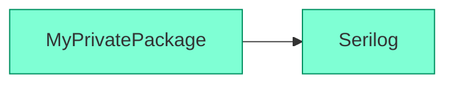
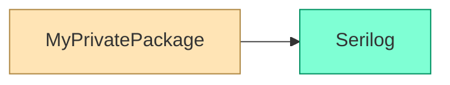

# Changelog

All notable changes to this project will be documented in this file.

The format is based on [Keep a Changelog](https://keepachangelog.com/en/1.0.0/), and this project adheres to [Semantic Versioning](https://semver.org/spec/v2.0.0.html).

## [Unreleased][Unreleased]

* Links to nuget.org are now added only for packages which are actually available on the NuGet Gallery. Previously, a non-working link to nuget.org would be added for packages coming from private NuGet feeds.
* Packages which are unavailable on the NuGet Gallery are now rendered in beige (moccasin), unless the `--no-links` options is specified.

Before:

After:

## [0.4.0][0.4.0] - 2025-06-26

* Fixed an issue where a project reference (blue) could be wrongly identified as package reference (green)
* Removed the `--no-browser` option, replaced with the `-u|--url` option
* Logs and status are now written to stderr. Only actual content is written to stdout, i.e.
  * The graph URL when `--url print` is used
  * The output of the `--help` and `--version` options

## [0.3.0][0.3.0] - 2025-06-24

Initial release

[Unreleased]: https://github.com/0xced/nugraph/compare/0.4.0...HEAD
[0.4.0]: https://github.com/0xced/nugraph/compare/0.3.0...0.4.0
[0.3.0]: https://github.com/0xced/nugraph/compare/b581197c8849922788f3e79fd88b417a8ca18db6...0.3.0
