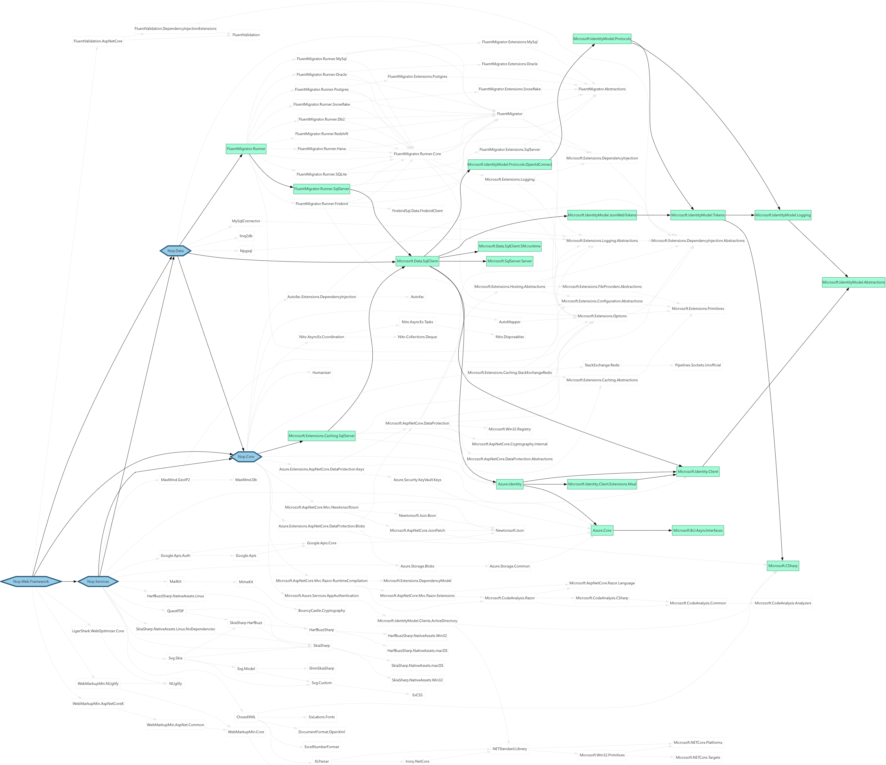

nugraph is a [.NET tool](https://learn.microsoft.com/en-us/dotnet/core/tools/global-tools) for creating visual dependency graph of NuGet packages.

[](https://www.nuget.org/packages/nugraph) [](https://github.com/0xced/nugraph/actions/workflows/continuous-integration.yml)

A picture is worth a thousand words, so here's the dependency graph produced by running

```shell
nugraph Microsoft.Extensions.Logging.Console
```



```mermaid
---
title: Dependency graph of Microsoft.Extensions.Logging.Console 9.0.6 (net8.0)
---

graph LR

classDef root stroke-width:4px
classDef default fill:aquamarine,stroke:#009061,color:#333333

Microsoft.Extensions.Configuration --> Microsoft.Extensions.Configuration.Abstractions
Microsoft.Extensions.Configuration --> Microsoft.Extensions.Primitives
Microsoft.Extensions.Configuration.Abstractions --> Microsoft.Extensions.Primitives
Microsoft.Extensions.Configuration.Binder --> Microsoft.Extensions.Configuration.Abstractions
Microsoft.Extensions.DependencyInjection --> Microsoft.Extensions.DependencyInjection.Abstractions
Microsoft.Extensions.Logging --> Microsoft.Extensions.DependencyInjection
Microsoft.Extensions.Logging --> Microsoft.Extensions.Logging.Abstractions
Microsoft.Extensions.Logging --> Microsoft.Extensions.Options
Microsoft.Extensions.Logging.Abstractions --> Microsoft.Extensions.DependencyInjection.Abstractions
Microsoft.Extensions.Logging.Abstractions --> System.Diagnostics.DiagnosticSource
Microsoft.Extensions.Logging.Configuration --> Microsoft.Extensions.Configuration
Microsoft.Extensions.Logging.Configuration --> Microsoft.Extensions.Configuration.Abstractions
Microsoft.Extensions.Logging.Configuration --> Microsoft.Extensions.Configuration.Binder
Microsoft.Extensions.Logging.Configuration --> Microsoft.Extensions.DependencyInjection.Abstractions
Microsoft.Extensions.Logging.Configuration --> Microsoft.Extensions.Logging
Microsoft.Extensions.Logging.Configuration --> Microsoft.Extensions.Logging.Abstractions
Microsoft.Extensions.Logging.Configuration --> Microsoft.Extensions.Options
Microsoft.Extensions.Logging.Configuration --> Microsoft.Extensions.Options.ConfigurationExtensions
Microsoft.Extensions.Logging.Console{{Microsoft.Extensions.Logging.Console}} --> Microsoft.Extensions.DependencyInjection.Abstractions
Microsoft.Extensions.Logging.Console --> Microsoft.Extensions.Logging
Microsoft.Extensions.Logging.Console --> Microsoft.Extensions.Logging.Abstractions
Microsoft.Extensions.Logging.Console --> Microsoft.Extensions.Logging.Configuration
Microsoft.Extensions.Logging.Console --> Microsoft.Extensions.Options
Microsoft.Extensions.Logging.Console --> System.Text.Json
Microsoft.Extensions.Options --> Microsoft.Extensions.DependencyInjection.Abstractions
Microsoft.Extensions.Options --> Microsoft.Extensions.Primitives
Microsoft.Extensions.Options.ConfigurationExtensions --> Microsoft.Extensions.Configuration.Abstractions
Microsoft.Extensions.Options.ConfigurationExtensions --> Microsoft.Extensions.Configuration.Binder
Microsoft.Extensions.Options.ConfigurationExtensions --> Microsoft.Extensions.DependencyInjection.Abstractions
Microsoft.Extensions.Options.ConfigurationExtensions --> Microsoft.Extensions.Options
Microsoft.Extensions.Options.ConfigurationExtensions --> Microsoft.Extensions.Primitives
System.Text.Json --> System.IO.Pipelines
System.Text.Json --> System.Text.Encodings.Web

class Microsoft.Extensions.Configuration default
click Microsoft.Extensions.Configuration "https://www.nuget.org/packages/Microsoft.Extensions.Configuration/9.0.6" "Microsoft.Extensions.Configuration 9.0.6"
class Microsoft.Extensions.Configuration.Abstractions default
click Microsoft.Extensions.Configuration.Abstractions "https://www.nuget.org/packages/Microsoft.Extensions.Configuration.Abstractions/9.0.6" "Microsoft.Extensions.Configuration.Abstractions 9.0.6"
class Microsoft.Extensions.Configuration.Binder default
click Microsoft.Extensions.Configuration.Binder "https://www.nuget.org/packages/Microsoft.Extensions.Configuration.Binder/9.0.6" "Microsoft.Extensions.Configuration.Binder 9.0.6"
class Microsoft.Extensions.DependencyInjection default
click Microsoft.Extensions.DependencyInjection "https://www.nuget.org/packages/Microsoft.Extensions.DependencyInjection/9.0.6" "Microsoft.Extensions.DependencyInjection 9.0.6"
class Microsoft.Extensions.DependencyInjection.Abstractions default
click Microsoft.Extensions.DependencyInjection.Abstractions "https://www.nuget.org/packages/Microsoft.Extensions.DependencyInjection.Abstractions/9.0.6" "Microsoft.Extensions.DependencyInjection.Abstractions 9.0.6"
class Microsoft.Extensions.Logging default
click Microsoft.Extensions.Logging "https://www.nuget.org/packages/Microsoft.Extensions.Logging/9.0.6" "Microsoft.Extensions.Logging 9.0.6"
class Microsoft.Extensions.Logging.Abstractions default
click Microsoft.Extensions.Logging.Abstractions "https://www.nuget.org/packages/Microsoft.Extensions.Logging.Abstractions/9.0.6" "Microsoft.Extensions.Logging.Abstractions 9.0.6"
class Microsoft.Extensions.Logging.Configuration default
click Microsoft.Extensions.Logging.Configuration "https://www.nuget.org/packages/Microsoft.Extensions.Logging.Configuration/9.0.6" "Microsoft.Extensions.Logging.Configuration 9.0.6"
class Microsoft.Extensions.Logging.Console root
class Microsoft.Extensions.Logging.Console default
click Microsoft.Extensions.Logging.Console "https://www.nuget.org/packages/Microsoft.Extensions.Logging.Console/9.0.6" "Microsoft.Extensions.Logging.Console 9.0.6"
class Microsoft.Extensions.Options default
click Microsoft.Extensions.Options "https://www.nuget.org/packages/Microsoft.Extensions.Options/9.0.6" "Microsoft.Extensions.Options 9.0.6"
class Microsoft.Extensions.Options.ConfigurationExtensions default
click Microsoft.Extensions.Options.ConfigurationExtensions "https://www.nuget.org/packages/Microsoft.Extensions.Options.ConfigurationExtensions/9.0.6" "Microsoft.Extensions.Options.ConfigurationExtensions 9.0.6"
class Microsoft.Extensions.Primitives default
click Microsoft.Extensions.Primitives "https://www.nuget.org/packages/Microsoft.Extensions.Primitives/9.0.6" "Microsoft.Extensions.Primitives 9.0.6"
class System.Diagnostics.DiagnosticSource default
click System.Diagnostics.DiagnosticSource "https://www.nuget.org/packages/System.Diagnostics.DiagnosticSource/9.0.6" "System.Diagnostics.DiagnosticSource 9.0.6"
class System.IO.Pipelines default
click System.IO.Pipelines "https://www.nuget.org/packages/System.IO.Pipelines/9.0.6" "System.IO.Pipelines 9.0.6"
class System.Text.Encodings.Web default
click System.Text.Encodings.Web "https://www.nuget.org/packages/System.Text.Encodings.Web/9.0.6" "System.Text.Encodings.Web 9.0.6"
class System.Text.Json default
click System.Text.Json "https://www.nuget.org/packages/System.Text.Json/9.0.6" "System.Text.Json 9.0.6"
```

## Installation

```shell
dotnet tool install --global nugraph
```

> [!TIP]
> On macOS, the first time a .NET global tool is installed, the PATH environment variable [must be adjusted](https://github.com/dotnet/sdk/issues/9415#issuecomment-406915716).

## Usage

`nugraph` can generate dependency graphs for either a single NuGet package or for an exising .NET project. Run `nugraph --help` to see all the supported options.

### NuGet package mode

Run `nugraph <NuGetPackageName>` to generate the dependency graph of a NuGet package. For example, run `nugraph Serilog.Sinks.File` to generate the dependency graph of the [Serilog.Sinks.File](https://www.nuget.org/packages/Serilog.Sinks.File) package.

A specific version can be explicitly requested by appending **/version** to the package name, for example `nugraph Serilog.Sinks.File/4.1.0`. When no version is specified, the latest version available on NuGet is chosen. 

Many packages support multiple target frameworks and sometimes the dependencies varies across different target frameworks. A target framework is guessed automatically, but it can be overriden with the `-f` or `--framework` option.

### .NET project mode

In addition to NuGet packages graphs, nugraph can also create graphs of .NET projects, i.e. `.csproj`, `.fsproj` and `.vbproj` files.

Without any argument, `nugraph` creates the graph of the project in the current working directory. An existing directory or an existing project file can also be passed explicitly. Under the hood, nugraph calls `dotnet restore` to resolve dependencies, so any private NuGet feeds configured in `NuGet.config` will just work.

Here's an example with an open source project that produces a large graph. The ignore option (`-i`) is used to remove all the System.* and Humanizer.Core.* packages to make the graph more readable. The `--no-links` option is also specified to smooth using the excellent [Graphviz Interactive Preview](https://marketplace.visualstudio.com/items?itemName=tintinweb.graphviz-interactive-preview) extension for Visual Studio Code.

```shell
git clone https://github.com/nopSolutions/nopCommerce
nugraph nopCommerce/src/Presentation/Nop.Web/Nop.Web.csproj -o nopCommerce.gv -i "System.*" -i "Humanizer.Core.*" --no-links
code nopCommerce.gv
```

When a node is selected in Graphviz Interactive Preview, all the connected nodes are highlighted and the non-connected nodes are dimmed. This helps to understand how a single dependency is used. Here's what happens when the `Microsoft.Data.SqlClient` node is selected.



> [!NOTE]
> Package references are rendered in green and project references are rendered in blue. The hexagon shaped boxes represent the roots of the graph, i.e. the explicit package or project references in the project file.

### Output

To write the dependency graph to a file, use the `-o` or `--output` options. If the output file name ends with either `.mmd` or `.mermaid` a [Mermaid](https://mermaid.js.org) file will be written.
Otherwise, a [Graphviz](https://graphviz.org) file will be written. Suggested extensions for Graphviz files are `.gv` or `.dot`.

When no output options is specified, the format can be chosen with the `-m` or `--format` option. The default browser will be opened to one of the supported online services.

#### Mermaid

| `-m` or `--format` | [mermaid.live](https://mermaid.live) | [mermaid.ink](https://mermaid.ink) | [kroki.io](https://kroki.io)           |
|--------------------|--------------------------------------|------------------------------------|----------------------------------------|
| interactive (view) | _unspecified_ or `mmd` or `mermaid`  |                                    |                                        |
| interactive (edit) | `mmd-edit` or `mermaid-edit`         |                                    |                                        |
| svg                |                                      | `mmd.svg` or `mermaid.svg`         | `mmd.kroki.svg` or `mermaid.kroki.svg` |
| png                |                                      | `mmd.png` or `mermaid.png`         | `mmd.kroki.png` or `mermaid.kroki.png` |
| jpg                |                                      | `mmd.jpg` or `mermaid.jpg`         |                                        |
| webp               |                                      | `mmd.webp` or `mermaid.webp`       |                                        |

For example, run `nugraph Microsoft.Data.SqlClient -m mmd.svg` to open the graph as an SVG file rendered in the default browser using the Mermaid Ink service.

#### Graphviz

| `-m` or `--format` | [edotor.net](https://edotor.net) | [kroki.io](https://kroki.io) |
|--------------------|----------------------------------|------------------------------|
| interactive        | or `dot` or `gv`                 |                              |
| svg                |                                  | `dot.svg` or `gv.svg`        |
| png                |                                  | `dot.png` or `gv.png`        |
| jpg                |                                  | `dot.jpg` or `gv.jpg`        |
| pdf                |                                  | `dot.pdf` or `gv.pdf`        |

For example, run `nugraph Microsoft.Data.SqlClient -m dot` to open the graph in the Edotor interactive service.

> [!TIP]
> The interactive, SVG and PDF formats have clickable links to the nuget.org page of the packages, unless the `--no-links` option is specified.
