nugraph is a [.NET tool](https://learn.microsoft.com/en-us/dotnet/core/tools/global-tools) for creating visual dependency graph of NuGet packages.

A picture is worth a thousand words, so here's the dependency graph produced by running `nugraph Microsoft.Extensions.Logging.Console`

```mermaid
graph LR

classDef root stroke-width:4px
classDef default fill:aquamarine,stroke:#009061,color:#333333

Microsoft.Extensions.Configuration --> Microsoft.Extensions.Configuration.Abstractions
Microsoft.Extensions.Configuration --> Microsoft.Extensions.Primitives
Microsoft.Extensions.Configuration.Abstractions --> Microsoft.Extensions.Primitives
Microsoft.Extensions.Configuration.Binder --> Microsoft.Extensions.Configuration.Abstractions
Microsoft.Extensions.DependencyInjection --> Microsoft.Extensions.DependencyInjection.Abstractions
Microsoft.Extensions.Logging --> Microsoft.Extensions.DependencyInjection
Microsoft.Extensions.Logging --> Microsoft.Extensions.Logging.Abstractions
Microsoft.Extensions.Logging --> Microsoft.Extensions.Options
Microsoft.Extensions.Logging.Abstractions --> Microsoft.Extensions.DependencyInjection.Abstractions
Microsoft.Extensions.Logging.Abstractions --> System.Diagnostics.DiagnosticSource
Microsoft.Extensions.Logging.Configuration --> Microsoft.Extensions.Configuration
Microsoft.Extensions.Logging.Configuration --> Microsoft.Extensions.Configuration.Abstractions
Microsoft.Extensions.Logging.Configuration --> Microsoft.Extensions.Configuration.Binder
Microsoft.Extensions.Logging.Configuration --> Microsoft.Extensions.DependencyInjection.Abstractions
Microsoft.Extensions.Logging.Configuration --> Microsoft.Extensions.Logging
Microsoft.Extensions.Logging.Configuration --> Microsoft.Extensions.Logging.Abstractions
Microsoft.Extensions.Logging.Configuration --> Microsoft.Extensions.Options
Microsoft.Extensions.Logging.Configuration --> Microsoft.Extensions.Options.ConfigurationExtensions
Microsoft.Extensions.Logging.Console{{Microsoft.Extensions.Logging.Console}} --> Microsoft.Extensions.DependencyInjection.Abstractions
Microsoft.Extensions.Logging.Console{{Microsoft.Extensions.Logging.Console}} --> Microsoft.Extensions.Logging
Microsoft.Extensions.Logging.Console{{Microsoft.Extensions.Logging.Console}} --> Microsoft.Extensions.Logging.Abstractions
Microsoft.Extensions.Logging.Console{{Microsoft.Extensions.Logging.Console}} --> Microsoft.Extensions.Logging.Configuration
Microsoft.Extensions.Logging.Console{{Microsoft.Extensions.Logging.Console}} --> Microsoft.Extensions.Options
Microsoft.Extensions.Logging.Console{{Microsoft.Extensions.Logging.Console}} --> System.Text.Json
Microsoft.Extensions.Options --> Microsoft.Extensions.DependencyInjection.Abstractions
Microsoft.Extensions.Options --> Microsoft.Extensions.Primitives
Microsoft.Extensions.Options.ConfigurationExtensions --> Microsoft.Extensions.Configuration.Abstractions
Microsoft.Extensions.Options.ConfigurationExtensions --> Microsoft.Extensions.Configuration.Binder
Microsoft.Extensions.Options.ConfigurationExtensions --> Microsoft.Extensions.DependencyInjection.Abstractions
Microsoft.Extensions.Options.ConfigurationExtensions --> Microsoft.Extensions.Options
Microsoft.Extensions.Options.ConfigurationExtensions --> Microsoft.Extensions.Primitives
System.Text.Json --> System.IO.Pipelines
System.Text.Json --> System.Text.Encodings.Web

class Microsoft.Extensions.Configuration default
class Microsoft.Extensions.Configuration.Abstractions default
class Microsoft.Extensions.Configuration.Binder default
class Microsoft.Extensions.DependencyInjection default
class Microsoft.Extensions.DependencyInjection.Abstractions default
class Microsoft.Extensions.Logging default
class Microsoft.Extensions.Logging.Abstractions default
class Microsoft.Extensions.Logging.Configuration default
class Microsoft.Extensions.Logging.Console root
class Microsoft.Extensions.Logging.Console default
class Microsoft.Extensions.Options default
class Microsoft.Extensions.Options.ConfigurationExtensions default
class Microsoft.Extensions.Primitives default
class System.Diagnostics.DiagnosticSource default
class System.IO.Pipelines default
class System.Text.Encodings.Web default
class System.Text.Json default
```



## Installation

```sh
dotnet tool install --global nugraph
```

> [!TIP]
> On macOS, the first time a .NET global tool is installed, the PATH environment variable [must be adjusted](https://github.com/dotnet/sdk/issues/9415#issuecomment-406915716).

## Usage

In its simplest form, the `nugraph` command creates the dependency graph of the project in the current working directory and opens the resulting graph the default browser, leveraging the [Mermaid Live Editor](https://mermaid.live).